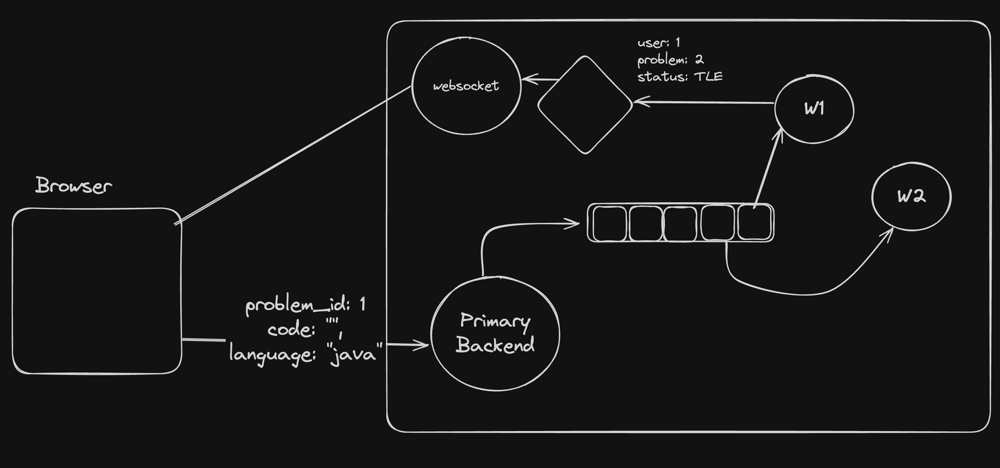

### Simulated Leetcode Backed Process

**Approach** :

1. Submission received at primary backend.
2. Entry made in the DB.
3. From there it is pushed to message queue.
4. Picked up by the worker node from queue.
5. Opertion performed & got updated in DB and sent to Pub Sub.
6. From Pub Sub, it is sent to all whose has subscribed[websocket] for that channel.
7. From websocket it is sent to appropriate user.
