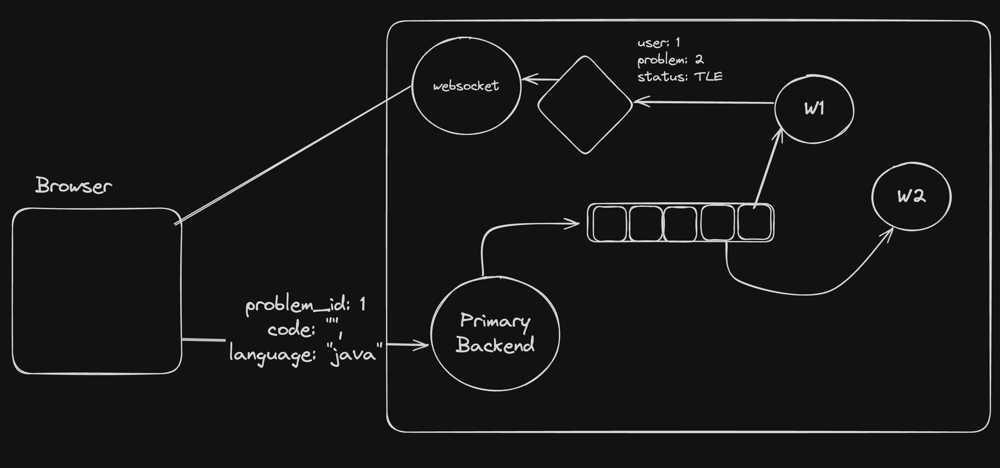

# Advanced Backend Communication

In the real world, a primary server doesn't handle all the request & operation , it `delegates` some tasks to other servers.
Why so? If we do all the operations on primary server then all the compute power will go into that rather than handling the users. So for the tasks which we can delegate we use seprate backend.

For ex - Notification , Doing some heavy computational work , tasks that only have to be done end of the Day.

So there are various Backends in a single application, therefore there are various ways for backend to talk.

- Http
- Websockets
- Pub Sub
- Message Queue

A basic example of this can be leetcode

After that Leetcode do something called `Pooling`, in this the client keep asking the primary server about the status of the operation by checking againg and againg from DB.
Once operation is complete running, it is updated in the DB by worker nodes.

Above approach works fine But there's a better approach using `Pub Sub` & `Websockets`.


Also it is updated in the DB side by side.

Approach :

1. Submission received at primary backend.
2. Entry made in the DB.
3. From there it is pushed to message queue.
4. Picked up by the worker node from queue.
5. Opertion performed & got updated in DB and sent to Pub Sub.
6. From Pub Sub, it is sent to all whose has subscribed for that channel.

Need of Pub Sub? Why can't we directly sent data to ws.
There can be many ws running & many people from different-different websocket server wants that data. So to made this possible we have to subscribe to that channel using pub sub.

To do that we have to learn something called `Redis` which offer queue & pub sub functioality.

## Redis

Redis is an open-source, in-memory data structure store, used as a database, cache, and message broker.
One of the key features of Redis is its ability to keep all data in memory, which allows for high performance and low latency access to data.

It stores data in ram , where other db stores data in disk.So data accessible is fast. It is mostly used for caching.

Couldn't data will be erased if machine stops?
**Yes**, so to avoid that we have 2 approach

1. using a long file to keep all the data.
2. taking snapshot of data every x seconds.

**`Running Redis using Docker`**

```ts
docker run --name my-redis -d -p 6379:6379 redis
docker exec -it container_id /bin/bash
redis-cli

// Setting and getting data
// you can set & get any data just like key valur pair.
SET name "Jayant"
GET name
DEL name
// name - key  , "Jayant" - value

SET problems "{id:'1',lang:'JS'}"
GET problems

// If you want to use db alike syntax then u can use `HSET and `HGET`, H - hashing
HSET user:100 name "John Doe" email "user@example.com" age "30"
HGET user:100 name
HGET user:100 email`
```

### Redis as Query

1. In `redis-cli`
   There can be 2 operations Push & POP
   if we are doing LPUSH then we have to use RPOP and vice versa.

   ```ts
    // problems - queue
    LPUSH problems 1
    LPUSH problems 2

    RPOP problems
    RPOP problems

    // blocks the pop if there is noting to pop with time limit of blocking
    BRPOP problems 0 // infinitely
    BRPOP problems 30
   ```

2. In Node.js
   `npm i redis` to use redis in nodejs app

   ```ts
   //sending the incoming request from frontend to queue which will be eventually picked up by the worker
   // Steps
   // 1) Creating a Server
   // 2) Creating a RedisClient to connect to the Redis Server
   // a) create the client and connect to the db
   // 3) Creating a POST Request
   // 4) push the data to the queue , by using LPush - Pushed to the left of queue - "Submissions"

   import express from "express";
   import { createClient } from "redis";

   const app = express();
   // parsing incoming data to json
   app.use(express.json());

   const RedisClient = createClient();
   app.post("/submit", async (req, res) => {
   	const { code, lang, problemId } = req.body;
   	// sending the data to the queue
   	try {
   		// maybe the queue is down so use try-catch
   		// sending the data to the queue
   		await RedisClient.lPush(
   			"Submissions",
   			JSON.stringify({ code, lang, problemId })
   		);
   		// store data in DB with status - PENDING
   		res.status(200).json({ message: "Code submitted successfully" });
   	} catch (e) {
   		res
   			.status(500)
   			.json({ message: "Code Submission Failed Try after some time" });
   	}
   });

   async function Connect() {
   	try {
   		await RedisClient.connect();
   		console.log("Connected to the redis");
   		app.listen(3000, () => {
   			console.log("Server is running on port 3000");
   		});
   	} catch (error) {
   		console.error("Failed to connect to Redis", error);
   	}
   }

   Connect();
   ```

   Worker node - takes the req from queue and process it

   ```ts
   // Steps:
   // 1) Pick/pop from the queue
   // 2) Run the Operation
   // 3) Made chnages to DB
   // 4) send them to Pub-sub
   // 5) Do this infinitely

   import { createClient } from "redis";

   const RedisClient = createClient();

   async function Connect() {
   	try {
   		await RedisClient.connect();
   		console.log("Connected to the Redis");

   		while (true) {
   			try {
   				// blocks the pop if there is noting to pop with time limit of blocking
   				const Submissions = await RedisClient.brPop("Submissions", 0);

   				//@ts-ignore
   				const { code, lang, problemId } = await JSON.parse(
   					Submissions.element
   				);

   				// Do some operations
   				await new Promise((r) => setTimeout(r, 1000)); // Simulating some operation)
   				console.log("Code passed all testcases");
   				RedisClient.publish(
   					"problem_done",
   					JSON.stringify({ code, lang, problemId })
   				);
   			} catch (e) {
   				console.log("Error getting the data", e);
   				// Push the submission back to the queue.
   			}
   		}
   	} catch (e) {
   		console.log("Error", e);
   	}
   }
   Connect();
   ```

### Pub Sub

It is a messaging pattern, in this there are 2 terms

1. Publisher - It Publishes the message to a particular topic.
2. Subscriber - It Subscribes to a particular topic.


The Subscriber don't know from which it was receiving the msg & also the Publisher don't know to who it was sending,

1. **IN Redis CLI**

```ts
	PUBLISH problem_done "{code:'lsllsls',lang:'JS',problemId:'23',userId:'1'}"
	SUBSCRIBE problem_done
```

2. **IN Node JS**

```ts
// Steps:
// 1) Pick/pop from the queue
// 2) Run the Operation
// 3) Made chnages to DB
// 4) send them to Pub-sub
// 5) Do this infinitely

import { createClient } from "redis";

const RedisClient = createClient();

async function Connect() {
	try {
		await RedisClient.connect();
		console.log("Connected to the Redis");

		while (true) {
			try {
				const Submissions = await RedisClient.brPop("Submissions", 0);

				//@ts-ignore
				const { code, lang, problemId } = await JSON.parse(Submissions.element);

				// Do some operations
				await new Promise((r) => setTimeout(r, 1000)); // Simulating some operation)
				console.log("Code passed all testcases");
				RedisClient.publish(
					"problem_done",
					JSON.stringify({ code, lang, problemId })
				);
			} catch (e) {
				console.log("Error getting the data", e);
				// Push the submission back to the queue.
			}
		}
	} catch (e) {
		console.log("Error", e);
	}
}
Connect();
```
